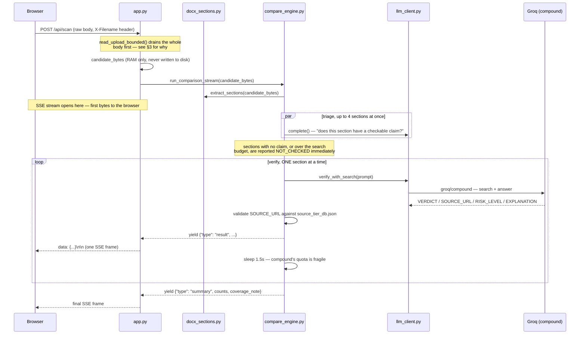
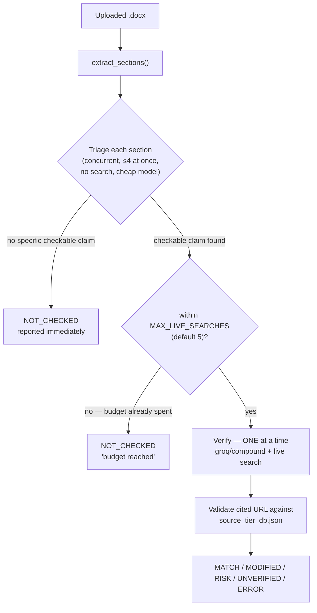

# How ClinSync Streaming Compare works

One-line version: **a user uploads a `.docx`, we read it straight into RAM (never to disk), triage every section for checkable clinical claims, live-verify a bounded subset of those against current external guidance, and stream each verdict to the browser the instant it's ready.**

This is a rewrite of an earlier design that compared a candidate document against one fixed baseline document. That design is gone — §7 explains why, because it's the most important thing to understand about this pivot.

---

## 1. The request, end to end



Still **one HTTP request**, still two phases (fully receive the upload, *then* stream results — §3c explains why those can't overlap on this stack). What changed is what happens *inside* the streaming phase: a fast concurrent triage pass, then a deliberately slow, serial, one-at-a-time verification pass.

---

## 2. No storage, by construction

Unchanged from the previous design: `scripts/upload_reader.py`'s `read_upload_bounded()` reads straight off the raw request stream (`request.stream()`) into a `bytearray` — no `tempfile`, no `open(..., "wb")`, no path anywhere in the request path. `candidate_bytes` lives in a Python variable for the duration of the request and is discarded once it finishes.

There is no longer a baseline document on disk either. The only thing this app reads from disk now is `references/source_tier_db.json` — a lookup table, not user data, loaded once and cached in memory (`scripts/source_tiers.py`).

---

## 3. File size policy — what actually happens with large files

*(Unchanged by this pivot — kept for reference.)*

FastAPI's normal upload pattern (`file: UploadFile = File(...)`) parses the entire multipart body *before your route code ever runs*, silently spilling anything over 1MB to a real temp file on disk with no size ceiling at that layer. We dropped `UploadFile`/multipart entirely; `/api/scan` reads `request.stream()` directly instead, giving us:

- **`Content-Length` pre-check** — reject with `413` before reading a single byte if already over `MAX_UPLOAD_MB`. Measured: a 20MB request rejected in **43ms**.
- **Incremental cap enforcement** — abort mid-transfer the instant a running total crosses the cap, regardless of what `Content-Length` claimed.
- **Soft warning tier** — `LARGE_FILE_WARN_MB`: files at or above this size process normally but get an `upload_warning` SSE event first.

The fix uncovered a real platform limit worth remembering: **you can't read a request body and stream its response concurrently on this uvicorn/Starlette stack.** `StreamingResponse` sends headers the moment it starts iterating its generator, and once that happens the server stops servicing `receive()` for that same request. So `read_upload_bounded()` must run to completion *before* `app.py` ever constructs the `StreamingResponse` — live upload progress can only come from the browser's own `XMLHttpRequest.upload.onprogress`, not the server.

---

## 4. Splitting a `.docx` into sections

`scripts/docx_sections.py` walks the document's paragraphs and starts a new section every time it hits a Word heading style (`Heading 1`, `Title`, etc.). Everything under that heading, up to the next heading, becomes that section's body text. A section is `{"title": "...", "text": "..."}`. Empty sections are dropped.

---

## 5. Two passes: triage, then bounded serial verification

This is the actual mechanism now, replacing the old baseline-alignment step entirely:



**Why two passes, not one.** Live search (`groq/compound`) is valuable but has a much tighter free-tier quota than a plain chat completion — confirmed by hitting both its per-minute *and* per-day token limits during testing (§10b). Checking every section live isn't viable on a free tier. So the cheap triage pass (same model as before, `openai/gpt-oss-120b`, no search, safely concurrent) decides which sections are even worth a live check — most patient-education content is background/reassurance/lifestyle text with nothing to fact-check. Only sections with a specific, checkable claim (a dose, an age threshold, a red-flag symptom, a statistic) consume search budget.

**Why serial, not concurrent, for the verify pass.** `MAX_CONCURRENT_TRIAGE = 4` is safe for triage because it doesn't touch `groq/compound`. Verification runs one call at a time with a deliberate `asyncio.sleep(1.5)` between calls — concurrency here reliably produced 429s in testing.

**`MAX_LIVE_SEARCHES` (default 5)** bounds the whole document, mirroring the reference product's own cap of "up to 10 searches per document" (`PRD.md §5.1.4`) — kept lower here because `groq/compound`'s quota is tighter than what the reference product built against (Perplexity, via a paid Anthropic call).

Sections that don't get a live check are never silently skipped — every one gets a `NOT_CHECKED` result with a reason (either "no checkable claim" from triage, or "budget reached" if triage flagged it but the cap was already spent). The document summary always states `"N of M sections were checked against live guidance."`

---

## 6. What the LLM actually does — two different prompts, two different jobs

**Triage** (`TRIAGE_SYSTEM_PROMPT`, cheap, no search): *"Does this section contain a specific, checkable clinical claim — a dose, age/weight threshold, screening interval, red-flag criterion, vaccine schedule, or statistic?"* Returns `{"checkable": true|false, "reason": "..."}`.

**Verify** (`VERIFY_PROMPT_TEMPLATE`, expensive, live search via `groq/compound`): given one section's text, search the web and confirm current guidance. Returns four delimited lines (not JSON — `groq/compound` combined with JSON mode wasn't something we verified works, and delimited text is robust either way):

```
VERDICT: CURRENT or OUTDATED or CANNOT_VERIFY
SOURCE_URL: the single most authoritative URL used, or NONE
RISK_LEVEL: LOW or MEDIUM or HIGH
EXPLANATION: one sentence
```

`_parse_verify_response()` in `compare_engine.py` then does two things worth calling out:

1. **Escalates deliberately, not automatically.** `OUTDATED` only becomes our `RISK` verdict when the model itself said `RISK_LEVEL: HIGH` — otherwise it's `MODIFIED`. The prompt explicitly steers that judgment: *"mark HIGH if the claim removes, softens, or contradicts a red-flag/stop-and-seek-care instruction... even if the wording sounds calm, confident, or medically plausible."* This is the same lesson learned the hard way in the previous design (a reassuring-sounding downplay of a real danger got under-called at first) — carried forward into this prompt from day one instead of re-discovering it.
2. **Downgrades an untrustworthy citation, regardless of what the model concluded.** Even a `CURRENT`/`MATCH` verdict gets forced to `UNVERIFIED` if the cited `SOURCE_URL` isn't in `source_tier_db.json`, or is marked `retired` there. The model's confidence doesn't matter if it cited something we don't recognize as authoritative — see §7.

---

## 7. The actual "source of truth" — and the gap that led here

The previous design's "source of truth" was one fixed baseline `.docx` — which only ever worked for whatever single topic someone hand-authored a baseline for (in practice: pregnancy wellness, because that's the real document we tested with). Uploading anything else just produced wall-to-wall `MISSING`/`UNVERIFIED`, because there was nothing to compare it to.

The team's actual reference material (`ClinSync dev/references/`) was never a baseline document at all — it's `source_tier_db.json`: a registry of **140 external authorities** (CDC, FDA, NIH, USPSTF, ACOG, professional societies, tiered 1–3 plus Q/E for quality/equity tools) that the reference product's real pipeline checks citations against. That's a fundamentally different mechanism: not "does this match a document we pre-approved," but "is this claim backed by a source we actually trust, checked live." This POC now does that instead.

`scripts/source_tiers.py`'s `lookup_source()` matches a cited URL's hostname against the registry and returns its tier, `retired` flag, and `replacement` if any. One real bug surfaced almost immediately: **a domain can have more than one entry.** `source_tier_db.json` lists both `"ahrq"` (active, `https://www.ahrq.gov`) and `"ahrq_guidelines"` (retired, `https://www.ahrq.gov/gam/index.html` — the decommissioned National Guideline Clearinghouse). Matching by hostname alone picked whichever entry happened to come first in the file — silently accepting a citation to a retired page as if it were current. Fixed by preferring the most *specific* URL match (longest matching prefix) instead of the first hostname match, so a citation to the retired page's exact URL correctly resolves to the retired entry, while any other `ahrq.gov` page still resolves to the active one. Verified with unit tests (both directions) since the live API's daily quota was already exhausted by the time this was found — see §10b.

---

## 8. Document-level roll-up

Same idea as before — an SME opens this tool to answer one question: *do I need to review this, and how urgently?* — extended to be honest about partial coverage:

```python
if counts["RISK"]:
    → highest_risk_level = "HIGH",         sme_review_needed = "YES — MANDATORY"
elif counts["MODIFIED"]:
    → highest_risk_level = "MEDIUM",       sme_review_needed = "YES — REQUIRED"
elif counts["UNVERIFIED"] or counts["ERROR"]:
    → highest_risk_level = "MEDIUM",       sme_review_needed = "OPTIONAL"
else:
    → highest_risk_level = "CONFIRMATORY", sme_review_needed = "NO"

coverage_note = f"{checked} of {total} section(s) were checked against live guidance."
```

One deliberate fix here: **`ERROR` (a technical failure — an API hiccup) is not treated as equivalent to `RISK` (an actual clinical finding).** An earlier version grouped them together, so a single flaky `groq/compound` call could force a false `HIGH`/`MANDATORY` verdict on an otherwise-clean document. `ERROR` now rolls up with `UNVERIFIED` instead — "inconclusive, worth another look" — which is what it actually means.

`coverage_note` ships on the `summary` event and renders under the risk banner (`web/index.html`) — so the banner never implies more coverage than actually happened.

---

## 9. Real output from testing against real guidance

Scanning the real, unedited pregnancy-wellness document, with `MAX_LIVE_SEARCHES=5`, triage selected 4 sections as checkable. All four came back `MATCH` with real, correct, tier-appropriate citations:

```
"Pregnancy Wellness: Second Trimester" → MATCH, source: nichd.nih.gov (Tier 1)
"Exercise"                             → MATCH, source: cdc.gov (Tier 1)
"Stop Exercising Right Away If You Have:" → MATCH, source: cdc.gov/hearher (Tier 1)
"Intimacy During Pregnancy"            → MATCH, source: acog.org (Tier 2)
```

Then, on the version with a deliberately softened safety warning ("light vaginal spotting... does not require you to stop or contact your care team"), the same section came back:

```
verdict: MODIFIED, risk_level: MEDIUM
source: pmc.ncbi.nlm.nih.gov (Tier 1)
"...current guidelines recommend stopping exercise and consulting a
healthcare provider if vaginal bleeding or spotting occurs."
```

This confirms the mechanism catches a real, live-verified contradiction — not just a diff against our own prior expectations, which is what the earlier baseline-diff version was actually testing.

---

## 10. Provider notes, and three real incidents worth knowing

`scripts/llm_client.py` is the only file that knows about Groq, Claude, or Perplexity specifically. `get_provider()` picks Groq if `GROQ_API_KEY` is set, else Claude if `ANTHROPIC_API_KEY` is set, else refuses to run — this decides who does triage and document classification.

**Live search verification is a separate decision from `get_provider()`.** `verify_with_search()` prefers `PERPLEXITY_API_KEY` if set — the same Claude + Perplexity pairing the reference product itself is built on — regardless of which provider is doing triage. With no Perplexity key, it falls back to one of Groq's own search-enabled "compound" models, which only works if `get_provider()` is `"groq"`. Running Claude with no Perplexity key has no live-search path at all (that would mean building a multi-turn tool-use loop around Claude's native `web_search` tool, which this POC doesn't do); every checkable section then falls back to `NOT_CHECKED` — an honest gap, not a silent one.

### 10a. Two incidents from testing with real documents (from the previous design, still relevant)

1. **A model got retired mid-session.** `llama-3.3-70b-versatile` worked, then 404'd. Fixed by querying `client.models.list()` live rather than guessing, moving to `openai/gpt-oss-120b`.
2. **The free tier's per-minute limit got hit under concurrent load.** Fixed with retry-on-429/503 with backoff (`llm_client.py`), honoring `retry-after`.

### 10b. A third incident: the search model has its own, tighter, multi-dimensional quota

Adding live verification surfaced a **separate** quota entirely, with more than one shape:

- **Per-minute tokens:** `Limit 30000, Used 26605` — hit within a handful of verify calls in the same document.
- **Per-day tokens:** `Limit 500000, Used 499879` — hit after repeated testing across a session.
- **Per-day requests, a completely different bucket:** `Limit 250, Used 250` — a flat request *count*, independent of token usage, that a full afternoon of testing exhausted on its own.

Two follow-on fixes came out of this:

- **`_with_retry()` now caps how long it will ever block for.** The daily-quota errors report `retry-after` values of 60–100+ seconds; honoring that literally, up to `MAX_RETRY_ATTEMPTS` times, meant a section could sit spinning for several minutes with zero feedback — indistinguishable from a hang to whoever's watching. `MAX_SINGLE_WAIT_SECONDS = 8` means anything the provider asks us to wait longer than that fails immediately instead — a fast, clear `ERROR` beats a slow, silent one.
- **The daily *request* quota is scoped to the Groq organization, not the individual API key.** A second key generated under the same account/email shares the same exhausted 250/day — confirmed by testing both keys against identical calls. A genuinely fresh quota needs a different account entirely.

**Lesson for the team:** a "free tier" API can have several independent quota buckets — per-minute and per-day, tokens *and* request-count, scoped to the org rather than the key — all for the same model. Read the actual error message rather than assuming one number covers everything, and design retry logic with a hard ceiling on how long any single call is allowed to block.

### 10c. A fourth incident: `groq/compound`'s search itself was broken on this tier — `groq/compound-mini` fixed it

Even with a fresh key and full quota, every verification call that actually triggered a web search failed with `413 Request Entity Too Large` — reproduced across multiple unrelated topics, prompt sizes down to one sentence, and both the old and new API key. Isolated by testing the *same* model with search explicitly disabled (worked fine) vs. explicitly requested (failed every time): the issue is specific to `groq/compound` invoking search on the free/`on_demand` tier, not our prompt, our token budget, or remaining quota.

`groq/compound-mini` — the lighter variant — does the same live-search job with a smaller internal search payload and works reliably; it's now the default `GROQ_SEARCH_MODEL`. Re-running the discharge-instructions document that had been failing produced 5/5 successful verifications with zero errors, including a genuine finding: FDA's actual OTC acetaminophen limit is 3,000mg/day, not the 4,000mg the document stated — correctly flagged `RISK`/`HIGH` with a real `fda.gov` citation.

**Lesson for the team:** when a specific model variant from a provider is unreliable, try the lighter/smaller sibling before assuming the whole feature is broken — the failure can be tier-specific to one variant's resource footprint, not the capability itself.

---

## 11. What's a deliberate POC limitation (tell the team this part)

- **Live search verification needs `PERPLEXITY_API_KEY` or `GROQ_API_KEY`.** Claude alone (no Perplexity key) triages and classifies fine but has no web-search step wired up — no native Anthropic `web_search` integration in this POC.
- **The search model's quota is genuinely tight, in more than one dimension** (tokens/minute, tokens/day, requests/day — §10b). Expect occasional `ERROR` results under sustained testing — this rolls up as `MEDIUM`/`OPTIONAL`, not a false `HIGH`, but it does mean real sections go unchecked.
- **`MAX_LIVE_SEARCHES` bounds coverage, always.** A 30-section document with 20 checkable claims still only gets 5 verified by default. The `coverage_note` makes this honest, but it's a real ceiling, not just a cost optimization.
- **Triage can misjudge.** It's a single cheap LLM call per section with no second opinion — a genuinely checkable claim can be triaged as "no checkable claim" and never reach verification.
- **No auth, no rate limiting, no result persistence.** Unchanged from before — refresh the page and results are gone.
- **`.docx` only**, validated via an `X-Filename` header.

---

## 12. Where things live

```
ClinSync-POC/
├── app.py                    FastAPI routes, SSE framing, upload orchestration
├── scripts/
│   ├── upload_reader.py      bounded, disk-free raw-body read (see §3)
│   ├── docx_sections.py      .docx → [{title, text}] sections, in-memory only
│   ├── compare_engine.py     triage pass + bounded serial verify pass + roll-up + SSE stream
│   ├── source_tiers.py       source_tier_db.json loader + specificity-based URL matching
│   └── llm_client.py         Groq/Claude provider abstraction + live-search verification
├── web/index.html            upload form (XHR) + live results panel + citation display + risk banner
├── references/source_tier_db.json   the real "source of truth" — 140 approved external authorities
└── .env                      GROQ_API_KEY, GROQ_MODEL, GROQ_SEARCH_MODEL, MAX_LIVE_SEARCHES, MAX_UPLOAD_MB, ...
```

Run it with `.venv/bin/python3 -m uvicorn app:app --port 8000`, open `http://localhost:8000`.
